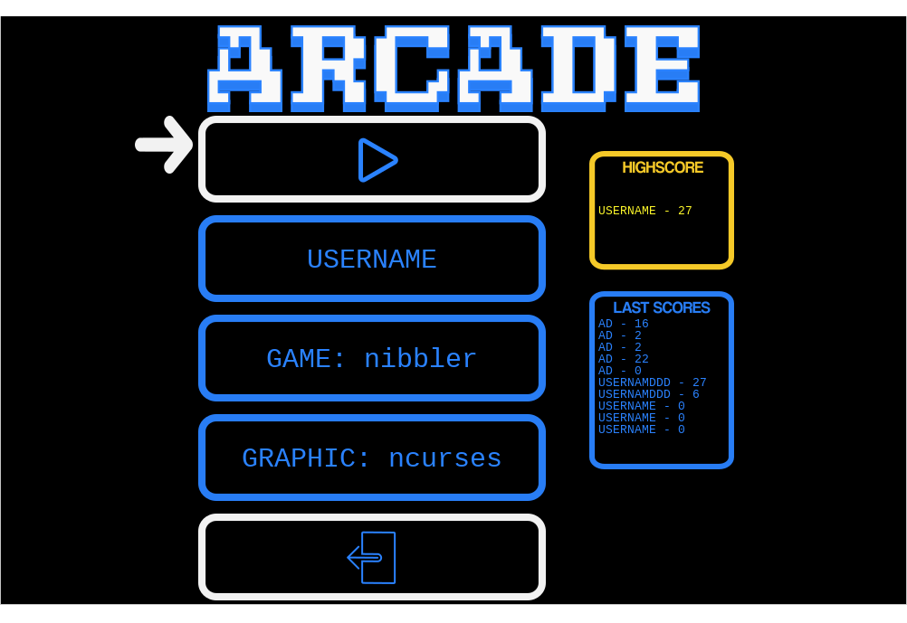
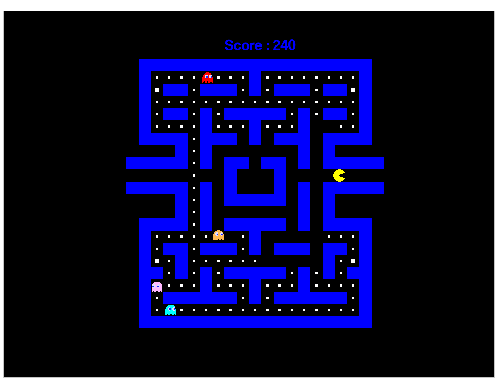
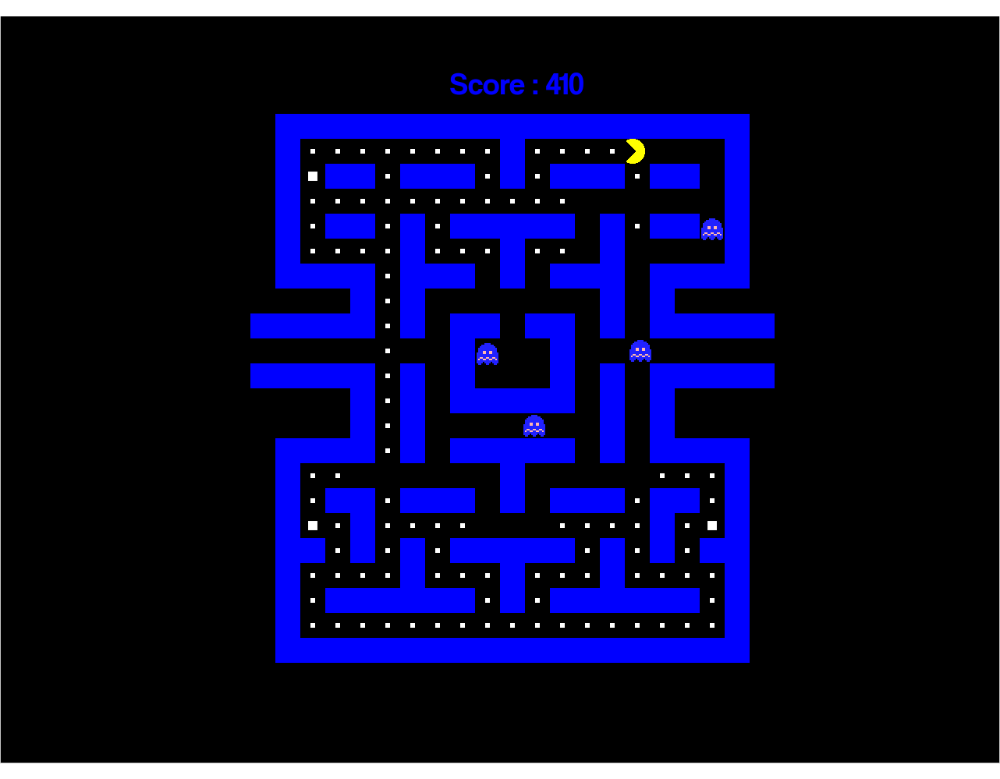
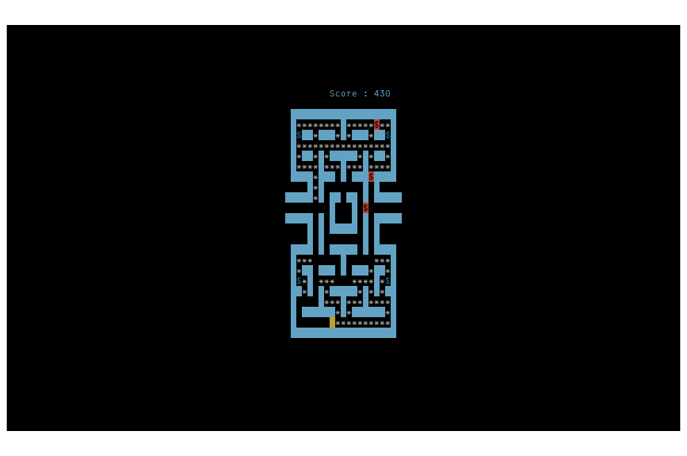
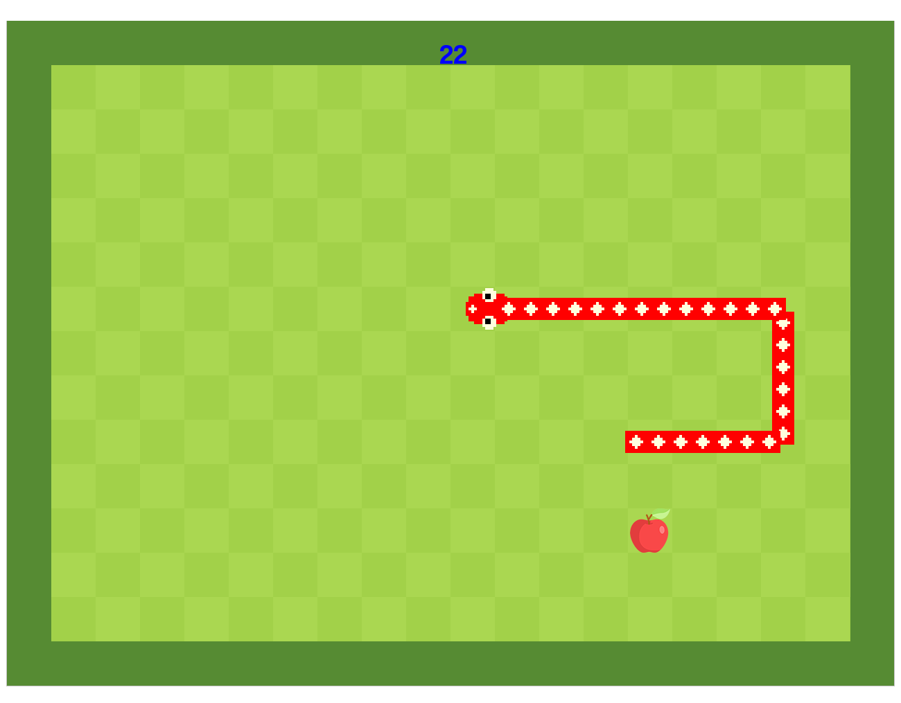
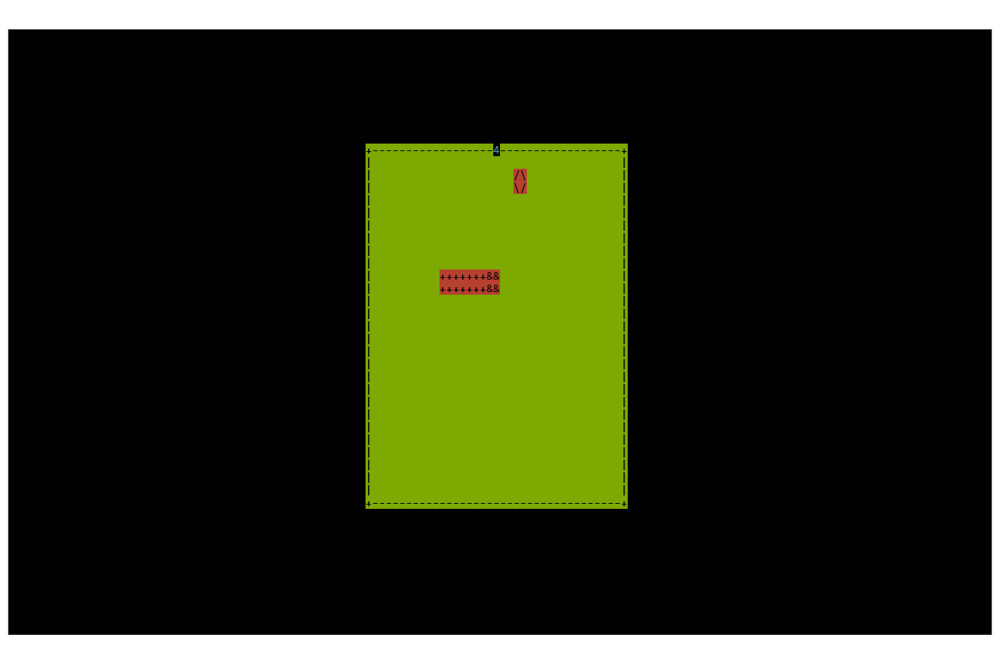

# Arcade

## About

Virtual arcade machine with a modudable code structure, the kernel is thus separated from the games and the graphic libraries.

## Screenshots

**Menu - SDL2**


**Pacman - SFML**


**Pacman - SDL2**


**Pacman - Ncurses**


**Nibbler - SFML**


**Nibbler - Ncurses**


## How to build and run ?

1. Install the dependencies

**Debian / Ubuntu**
```bash
sudo apt install libsdl2-2.0-0 libsdl2-gfx-1.0-0 libsdl2-image-2.0-0 libsdl2-mixer-2.0-0 libsdl2-net-2.0-0 libsdl2-ttf-2.0-0 libsfml-dev libncurses5-dev libncursesw5-dev
```

**Arch Linux**
```bash
sudo pacman -Sy sdl2 sdl2_image sdl2_gfx sdl2_ttf sfml ncurses
```

2. Compile with `make`
3. Run the binary named `arcade`

## Contribute

To implement a graphic library or a game, you can read our documentation in `doc/`

## Authors

* **Théo Bori** - [github](https://github.com/theobori)
* **Antonin Ricard** - [github](https://github.com/antonin-11)
* **Martin Galtier**
  